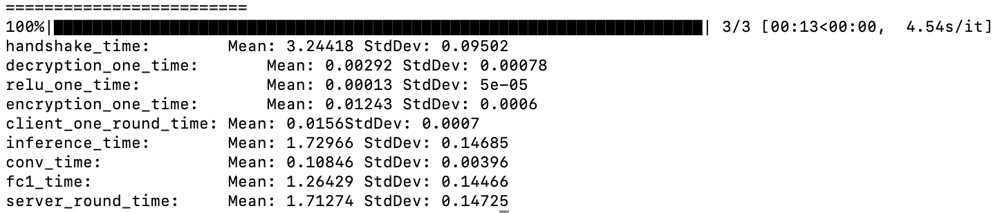

# Effhe - a privacy preserving protocol for encrypted neural network inference

EffHE is a client-server model in which the client is responsible for performing the non-linear calculations, while the server performs all the linear calculations. We have provided a proof- of-concept implementation of EffHE built upon TenSEAL, a nascent framework integrating homomorphic encryption with PyTorch.

# Here is how traditional encrypted inference takes place: 


# This is how Effhe works:


# How to install
```
make virtulenv
source venv/bin/activate
make all
```
# How to test

## In one terminal window run:
```
python effhe/server_client/server_1c1f.py
```


## In another terminal window run:
```
python effhe/scripts/test_effhe_1c1f.py 
```
See the magic happen.

## Final output on server and client side should look something like this:


