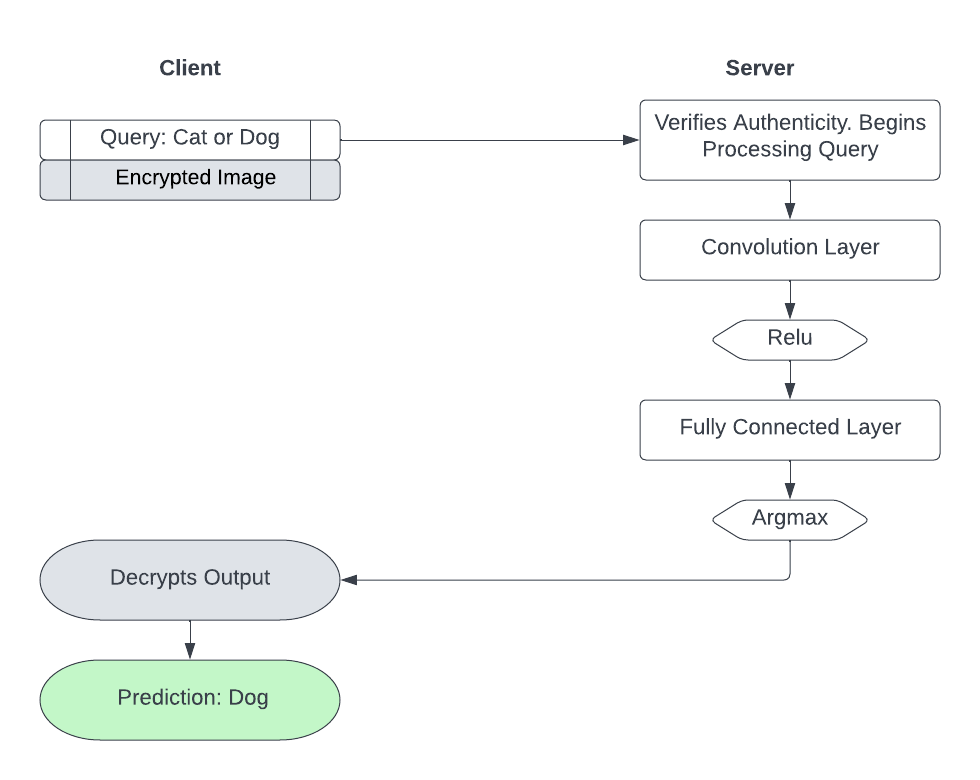
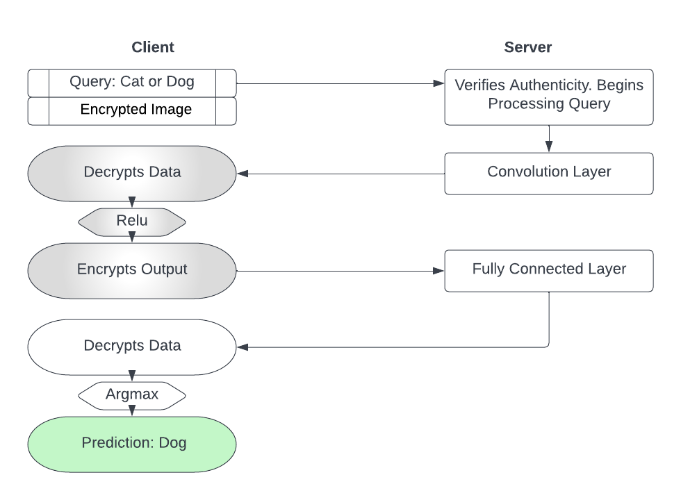

# Effhe - a privacy preserving protocol for encrypted neural network inference

EffHE is a client-server model in which the client is responsible for performing the non-linear calculations, while the server performs all the linear calculations. We have provided a proof- of-concept implementation of EffHE built upon TenSEAL, a nascent framework integrating homomorphic encryption with PyTorch.

# Here is how traditional encrypted inference takes place: 


# This is how Effhe works:



# How to install
```
make virtulenv
source venv/bin/activate
make all
```

